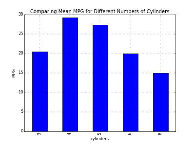
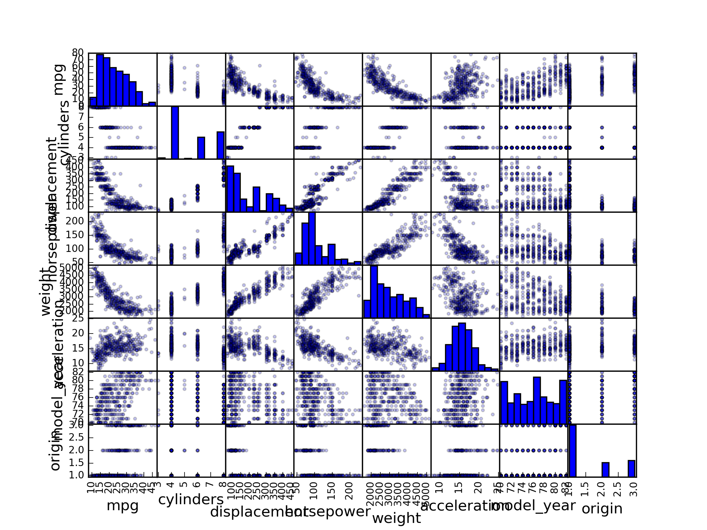
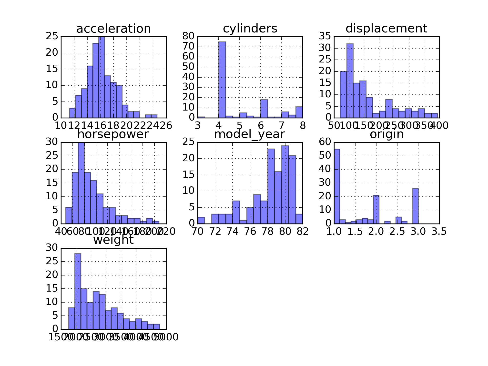
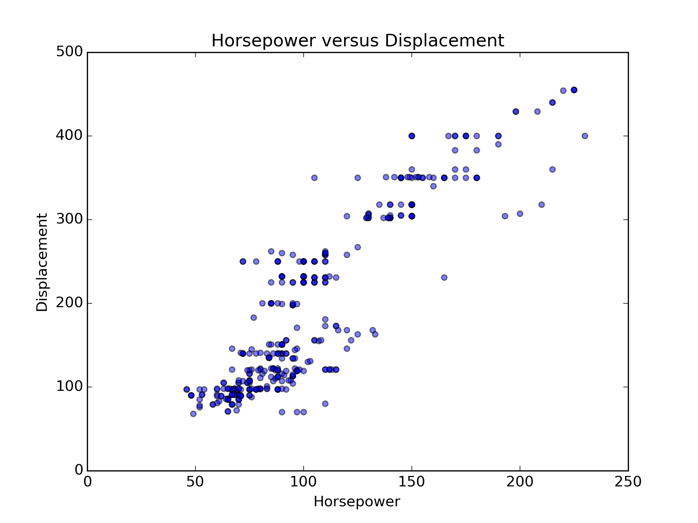
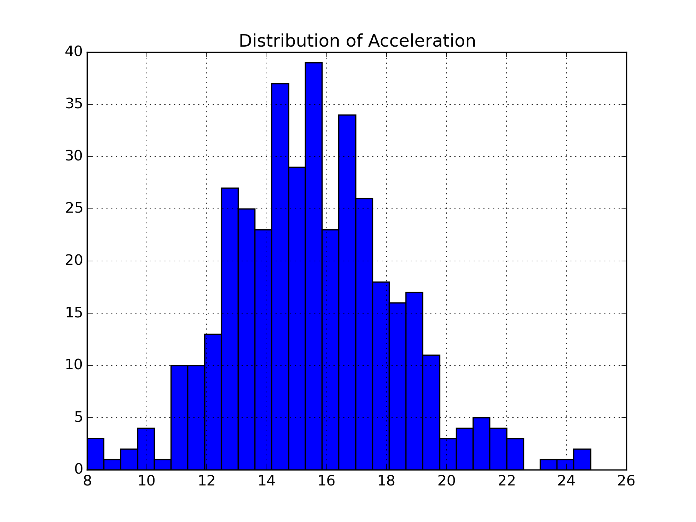
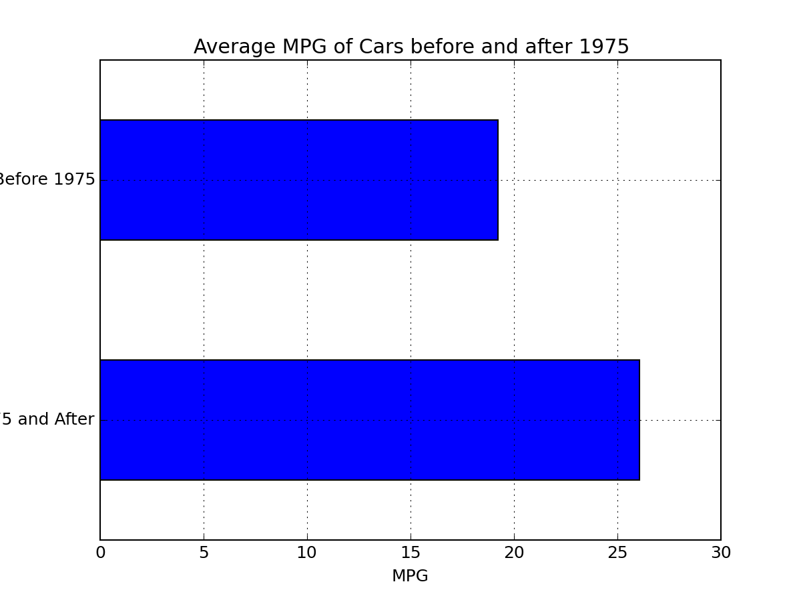

~~Hello World!~~
#GA-DC DAT5 Homework Four Visualizing Auto Data
######_With just enough illustrative code_
###Part 1

		Part 1
		Produce a plot that compares the mean mpg for the different numbers of cylinders.
		

		self.df.groupby('cylinders').mpg.mean().plot(kind='bar')
		plt.title("Comparing Mean MPG for Different Numbers of Cylinders")
		plt.ylabel("MPG")
		plt.savefig('cylinders_by_mean_mpg.png', dpi=50)
		plt.close()
		

_It seems clear that the most efficent number of cylinders is four and declines steeply after that._
###Part 2

		Part 2
		Use a scatter matrix to explore relationships between different numeric variables.
		

		self.dfnum = self.df._get_numeric_data()
		pd.scatter_matrix(self.dfnum, alpha=0.2, diagonal='hist')
		plt.savefig('scatter_matrix.png', dpi=250)
		plt.close()
		

_After looking at the entire scatter plot of numeric data, it seems that MPG is the most interesting variable to compare, so I'll make another scatterplot_
###Part 3

		Part 3
		Use a plot to answer the following questions:
		-Do heavier or lighter cars get better mpg? (A)
		-How are horsepower and displacement related? (B)
		-What does the distribution of acceleration look like? (C)
		-How is mpg spread for cars with different numbers of cylinders? (D)
		-Do cars made before or after 1975 get better average mpg? (Hint: You need to 
		create a new column that encodes whether a year is before or after 1975.)
		

####A and D 

		-Do heavier or lighter cars get better mpg? (A)
		-How is mpg spread for cars with different numbers of cylinders? (D)
		

		self.dfnum.groupby('mpg').mean().hist(alpha=0.5, bins=15)
		plt.savefig('histo_matrix_mpg.png', dpi=250)
		plt.close()
		

_For acceleration, it seems clear that there is a sweet spot around 16.5 for best MPG 		For displacement, weight and horsepower it seems clear that as they increase, MPG goes down. 		For model year, it trends than over time the MPG gets better._
####B 

		-How are horsepower and displacement related? (B)
		

		plt.scatter(self.dfnum.horsepower, self.dfnum.displacement, alpha=.5)
		plt.title("Horsepower versus Displacement")
		plt.xlabel("Horsepower")
		plt.ylabel("Displacement")
		plt.savefig('scatter_horsepower_vs_displacement.png', dpi=250)
		plt.close()

		

_In general, as horsepower increases the displacement increases._
####C 

		-What does the distribution of acceleration look like? (C)
		

		self.dfnum.acceleration.hist(bins=30)
		plt.title("Distribution of Acceleration")
		plt.savefig('hist_acceleration.png', dpi=250)
		plt.close()

		

_Acceleration looks normally distributed_
####D 

		-Do cars made before or after 1975 get better average mpg? (Hint: You need to 
		create a new column that encodes whether a year is before or after 1975.)
		

		def f (x):
			if x < 75:
				return True 
			else:
				return False	

		self.dfnum["before_75"] = df.model_year.apply(f)

		df.groupby('before_75').mpg.mean().plot(kind='barh')
		plt.xlabel("MPG")
		plt.ylabel("")
		plt.yticks((1, 0),('Before 1975', '1975 and After'))
		plt.title("Average MPG of Cars before and after 1975")
		plt.close()

		

_After 1975 the average MPG increases._

####BONUS BABY! 

		Look at MPG by Automobile Maker and see if anything else interesting pops out
		

*I need to figure out how to graph this data* 

_So looking at the data, it seems there there are some errors in spelling of car make names the data for each type of vehicle, for example: chevroelt, toyouta, vokswagen   _
make        model_year
amc         70            17.500000
            71            18.333333
            72            16.000000
            73            15.750000
            74            16.333333
            75            18.000000
            76            18.500000
            78            18.750000
            79            23.800000
            80            24.300000
audi        70            24.000000
            73            20.000000
            74            29.000000
            75            23.000000
            78            20.300000
            80            35.350000
bmw         70            26.000000
            77            21.500000
buick       70            14.500000
            72            13.000000
            73            12.500000
            74            13.000000
            75            19.000000
            77            25.250000
            78            19.150000
            79            22.650000
            81            24.500000
            82            25.000000
cadillac    76            16.500000
            79            23.000000
                            ...    
toyota      72            24.666667
            73            20.000000
            74            31.500000
            75            26.500000
            76            23.500000
            77            26.000000
            78            24.300000
            80            33.366667
            81            33.650000
            82            33.000000
triumph     80            35.000000
volkswagen  70            26.000000
            71            27.000000
            72            22.500000
            73            26.000000
            74            26.000000
            75            27.000000
            76            29.250000
            77            29.750000
            78            37.300000
            79            31.900000
            80            39.750000
            81            33.000000
            82            40.000000
volvo       72            18.000000
            73            19.000000
            75            22.000000
            76            20.000000
            78            17.000000
            81            30.700000
Name: mpg, dtype: float64
